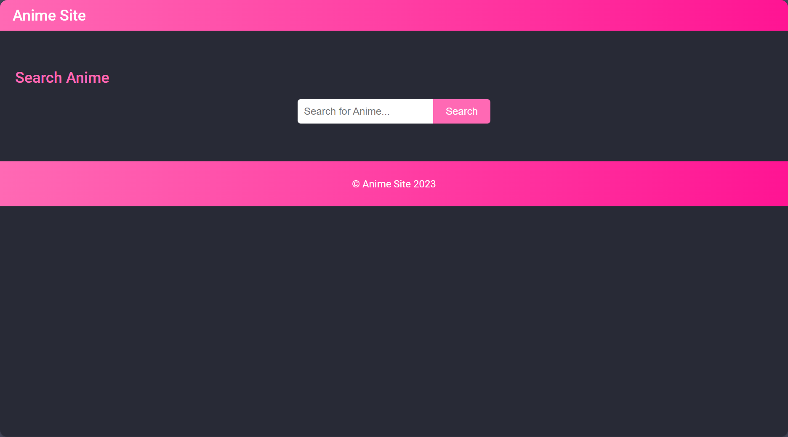
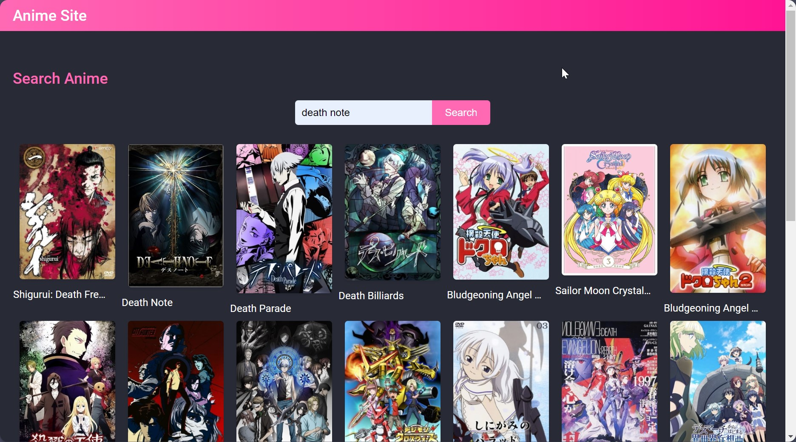
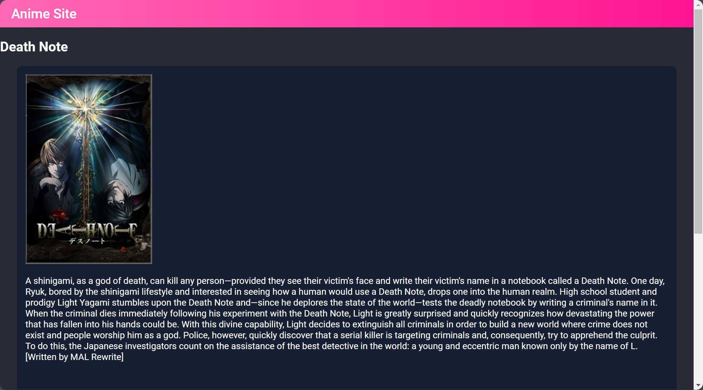
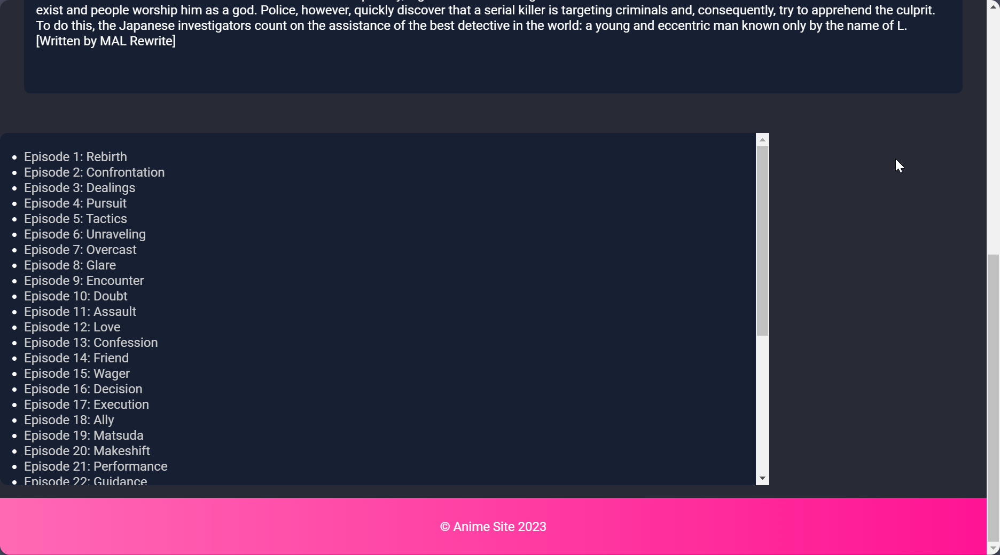

# 
AnimeSite

  

- Features
  - Easily search for anime series by name 
  - Responsive design that adapts to different screen sizes (works on computers, tablets, and phones) 
  - Enjoy watching anime with a cool video player 
  - Dropdown box for episodes when there are more than 100 episodes 

## Explore Your Favorite Anime

  <a href="https://animegamer4422.github.io/Test-Anime-Site/" style="font-size: 24px; font-family: Elephant, sans-serif; font-weight: bold; text-decoration: none;">
    Check it out!
  </a>

Welcome to AnimeSite where you can easily find and watch your favorite anime series. We built it using HTML, CSS, and JavaScript, and it uses the Consumet API to get all the anime information and images.

## Sneak Peek

- **Screenshot-1**
  

- **Screenshot-2**
  

- **Screenshot-3**
  

- **Screenshot-4**
  

## Get Started

To experience Anime Site on your computer, follow these simple steps:

1. Click the green "Code" button, then select "Download ZIP."
2. Open the downloaded folder and find the `index.html` file. Double-click to open it in your web browser.

## How to Use 

Seeking your favorite anime? Just type the name in the search box and click "Search." A grid of images for matching series will appear. Click "Show Video" to start watching.

## What We Used 

- [Plyr](https://plyr.io/): A simple, customizable HTML5 media player for an enhanced anime-watching experience
- [Consumet API](https://consumet.org/docs/): An API providing seamless access to extensive anime information and images

## Contribution

Excited to contribute? We welcome your ideas, bug reports, or feature requests. Let us know by opening an issue or sending a pull request.

## License

This project is licensed under the [MIT License](https://choosealicense.com/licenses/mit/). Check out the [LICENSE](LICENSE) file for more details.

# Contributors

<table align="center">
  <tr>
    <td align="center">
      <a href="https://github.com/animegamer4422">
        
         
        <strong>AnimeGamer</strong>
      </a>
    </td>
    <td align="center">
      <a href="https://github.com/YellowGreg">
        
         
        <strong>YellowGreg</strong>
      </a>
    </td>
  </tr>
</table>
